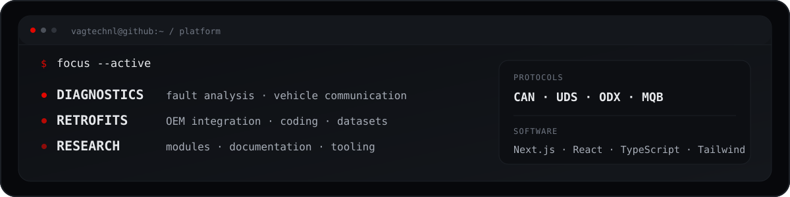
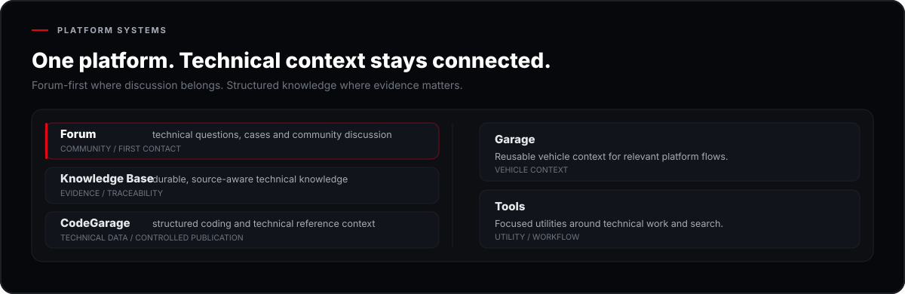
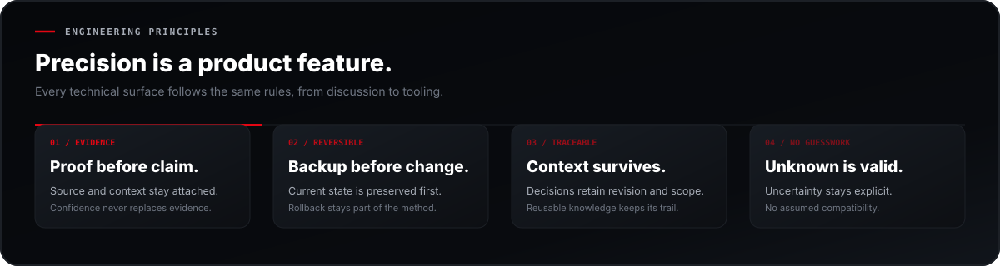
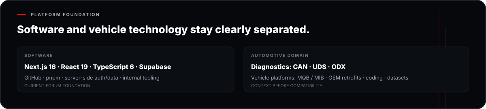

  <picture>
    <source media="(max-width: 600px)" srcset="https://raw.githubusercontent.com/VAGTechNL/VAGTechNL/main/assets/header-mobile.svg?v=2">
    
  </picture>

  <strong>Engineering first. Evidence over assumptions.</strong> 
  VAG diagnostics, OEM retrofits, coding, module research and software development.

  <picture>
    <source media="(max-width: 600px)" srcset="https://raw.githubusercontent.com/VAGTechNL/VAGTechNL/main/assets/terminal-mobile.svg">
    
  </picture>

  <picture>
    <source media="(max-width: 600px)" srcset="https://raw.githubusercontent.com/VAGTechNL/VAGTechNL/main/assets/projects-mobile.svg">
    
  </picture>

  <picture>
    <source media="(max-width: 600px)" srcset="https://raw.githubusercontent.com/VAGTechNL/VAGTechNL/main/assets/technical-flow-mobile.svg?v=4">
    
  </picture>

  <picture>
    <source media="(max-width: 600px)" srcset="https://raw.githubusercontent.com/VAGTechNL/VAGTechNL/main/assets/principles-mobile.svg">
    
  </picture>

  <picture>
    <source media="(max-width: 600px)" srcset="https://raw.githubusercontent.com/VAGTechNL/VAGTechNL/main/assets/stack-mobile.svg">
    
  </picture>

  <picture>
    <source media="(max-width: 600px)" srcset="https://raw.githubusercontent.com/VAGTechNL/VAGTechNL/main/assets/metrics-mobile.svg">
    
  </picture>

---

  <strong>VAGTechNL</strong> · Technical platform for VAG diagnostics, OEM retrofits, research and tooling.

  <strong>NAVIGATION</strong>&nbsp;·&nbsp;
  <a href="https://github.com/VAGTechNL/VAGTechNL/blob/main/README.md#projects">Projects</a>&nbsp;·&nbsp;
  <a href="https://github.com/VAGTechNL/VAGTechNL/blob/main/README.md#technical-flow">Technical flow</a>&nbsp;·&nbsp;
  <a href="https://github.com/VAGTechNL/VAGTechNL/blob/main/README.md#principles">Principles</a>&nbsp;·&nbsp;
  <a href="https://github.com/VAGTechNL/VAGTechNL/blob/main/README.md#stack">Stack</a>&nbsp;·&nbsp;
  <a href="https://github.com/VAGTechNL/VAGTechNL/blob/main/README.md#metrics">Metrics</a>&nbsp;·&nbsp;
  <a href="https://github.com/VAGTechNL">Back to top ↑</a>

  CAN / UDS / ODX · MQB · Evidence-driven · Reversible by default 
  Technical information is context-dependent. Verify source, revision and vehicle configuration. 
  © 2026 VAGTechNL · Automotive engineering meets software

